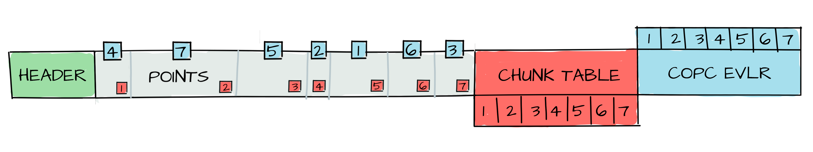

# Cloud Formats
Credits: [Alex Mandel](https://github.com/wildintellect), [Aimee Barciauskas](https://github.com/abarciauskas-bgse)

## Cloud Optimized Geospatial Formats

### What does “cloud-optimized” mean?

#### File formats are read-oriented to support

- Partial reads - only what you need for less data transfer.
- Parallel reads - read it faster
- (optional) Previews are stored with the data - you can see what it looks like without reading all the data.

**More Technical**

- Accessible over internet (HTTP) using range requests
   - This makes it compatible with object storage (a file storage alternative to local disk, that's what Cloud storage usually is, e.g. AWS S3, Google Storage, etc.) and thus accessible over the internet, from many compute instances.
- Supports lazy access and subsetting, only load what you need when you need it.

### Formats

A non-exhaustive list of some cloud optimized format common in the geospatial field right now.

| Format | Data Type |
| --- | --- |
| [Cloud-Optimized GeoTIFF (COG)](https://www.cogeo.org/)| Raster |
| [Flatgeobuf](https://flatgeobuf.org/), [GeoParquet](https://geoparquet.org/) | Vector |
| [Zarr](https://zarr.readthedocs.io/en/stable/), [Kerchunk](https://fsspec.github.io/kerchunk/) | Multi-dimensional raster |
| [Cloud-Optimized Point Cloud (COPC](https://copc.io/), [Entwine Point Tiles (EPT)](https://entwine.io/en/latest/entwine-point-tile.html) | Point Clouds |

> Vector formats can do point clouds (spatial index for s varies). The line between needing a point cloud-specific format vs a vector format is blurry.

### How it works

|
 |
| :---: |
| Image Credit - [COPC](https://copc.io/) | 

Usually there's a index, for spatial data it's usually a spatial index. Using this index you can locate the data you want quickly, and read it. For a single file format the index is at the beginning (aka Header), for a multi format file, it's a file that lists all the other files.

### Can QGIS open these?

For the most part, yes!!!
COG, COPC, Flatgeobuf, EPT should all just work.

GeoParquet depends on a new enough QGIS and GDAL. [Details](https://bertt.wordpress.com/2022/12/20/geoparquet-geospatial-vector-data-using-apache-parquet/)

Zarr it depends on the layout inside the file.
