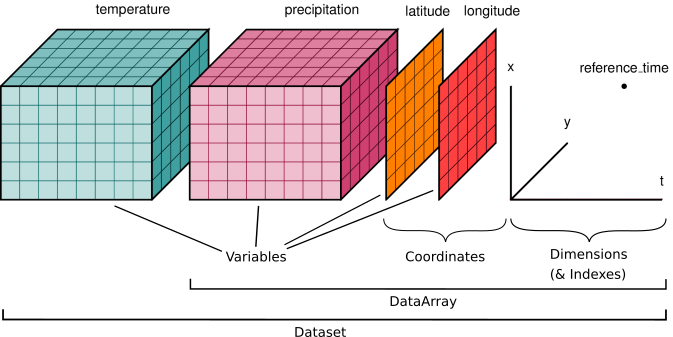

# Rasters

>Level: Beginner to Intermediate

## Gridded Data

Typically a regularly spaced grid, where each grid cell contains a value. There are no gaps, but you can have "no value" for a cell value.

> NoData value can be important when visualizing because you can drop this from the view.

You can make rasters by converting from vectors. This is often called Rasterizing.

Sometimes but not always collection is by Remote Sensing (aka Earth Observation or EO)

## Bands

1 Band = one set of values for all cells in the bounding box covered. The values can be compared to each other.

You can have many bands in 1 file, or spread across several files that go together. Each band represents a distinct set of values. It could be a different variable (temperature and humidity), or a different time (January, and February)

## Resolution

When talking about Remote Sensing

- Spatial: the size a pixel represents on the ground.
- Temporal: how often the data is available for the same place (hourly, daily, weekly, etc...). 
- Spectral: what part of the electromagnetic spectrum (e.g. xray, red, green, near infrared) each band represents.

## Sensors

Also when talking about remote sensing

- Passive: measure the value that exists
- Active: measure the value returned by "lighting" the scene. Think like flash on a camera. Examples include RADAR, and LiDAR.

## Formats

So many, See [GDAL supported list](https://gdal.org/drivers/raster/index.html).

When making, asking for data try to stick to the most common formats, particularly ones that support file compression so you don't fill computer disks.

See also [Cloud Formats](CloudFormats.md).

## N-Dimensional Rasters

When you have more than 3 dimensions. 
Easiest example is X,Y location + Time + Bands
Sometimes called a Data Cube.

| |
|:--:|
|Credit: [Xarray](https://docs.xarray.dev/en/stable/) Project|

### Formats

- HDF: Heirachical Data Format
    - netcdf: a specific flavor of HDF for climate science

- Zarr: An implementation of HDF concepts in a cloud-optimized way. See also See also [Cloud Formats](CloudFormats.md).

- Kerchunk: a Zarr style index that points to HDF5/netcdf files. Lets you use HDF as if it's a Zarr but not as fast.
