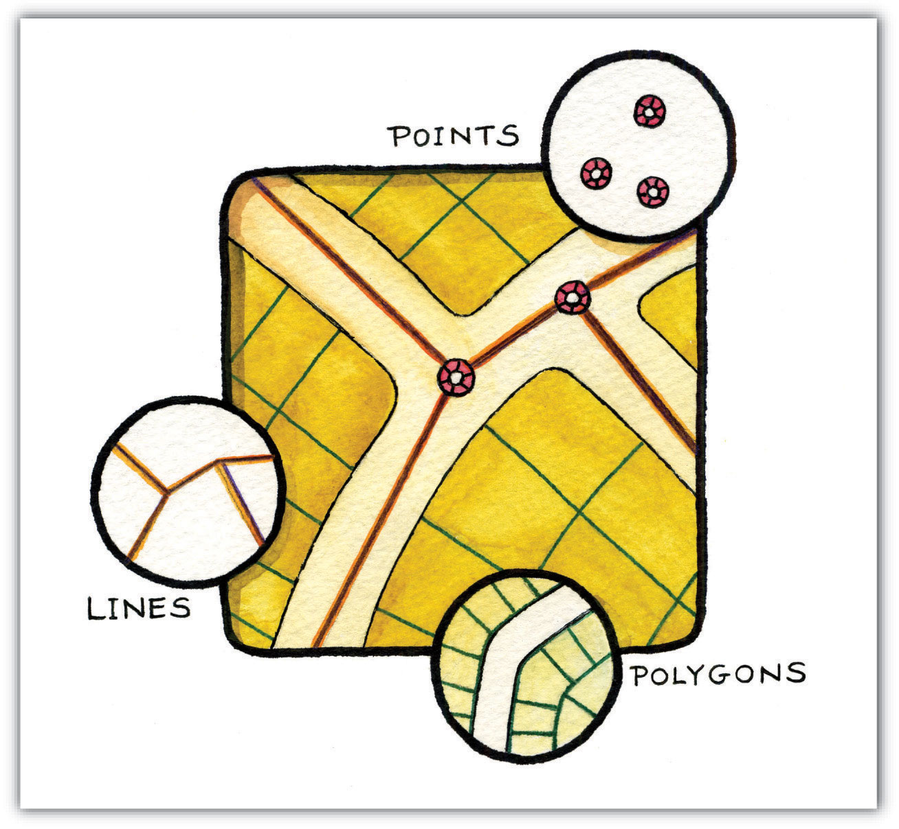

# Topology

>Level: Intermediate

There are several conceptual ways to store vector data. The more common style, often called the "spaghetti model" each shape is stored on it's own completely independent of all other shapes in the layer/file. This page is about the other major style called Topological where the data is stored in a way that every object is related to adjacent objects.

## What is Topology?

Topology is the relationship between objects. In GIS it's how points, lines, and polygons are related to each other.

| |
| :---: |
| [Credit: Saylor Academy](https://saylordotorg.github.io/) |

## Why Topological Data?

- You only store each point exactly once. So for polygons that share a common border you've removed 1/2 the data.
- You have a network that you know is contiguous. Routing a car would be awfully hard if the streets weren't connected to each other at intersections.
- You have polygons that are contiguous. No gaps at the borders are possible (aka slivers).

[Read More](https://wiki.gis.com/wiki/index.php/Topology)

## Why do I care?

There's a really important dataset out there that uses a Topological model ... [OpenStreetMap (OSM)](https://www.openstreetmap.org)

Understanding the data model really helps to understand how to edit OSM, and how to export and use OSM data. [OSM Data Model details](https://labs.mapbox.com/mapping/osm-data-model/)

> There's also another cool format call TopoJson which you can swap for GeoJson, when you've got a polygon layer with lots of overlapping or touching polygons.

See [More](https://docs.qgis.org/3.22/en/docs/gentle_gis_introduction/topology.html)